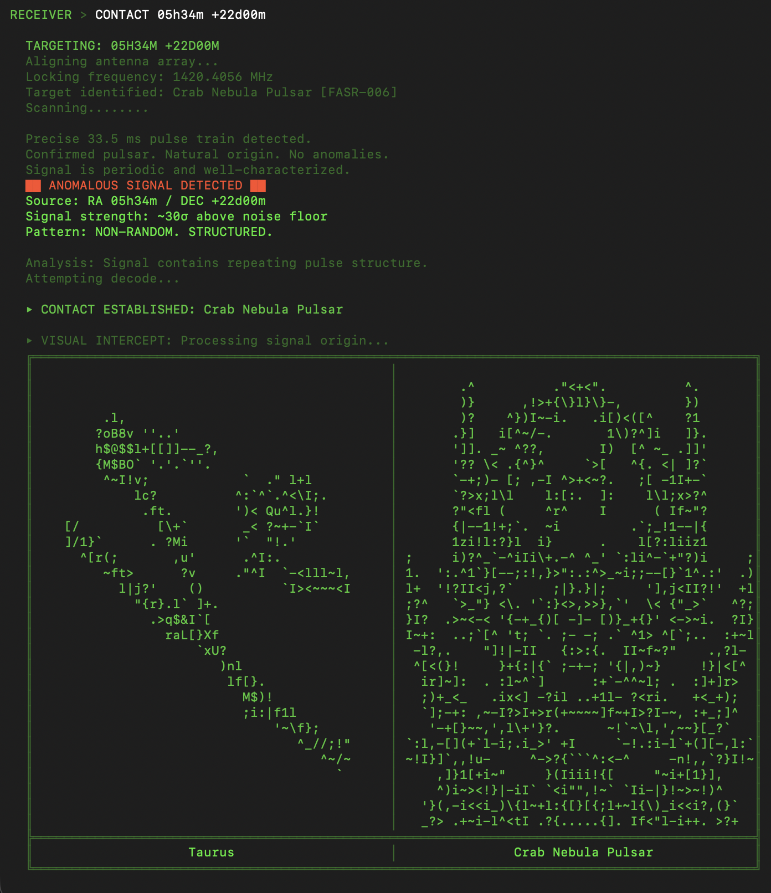

# 6EQUJ5


```text
═══════════════════════════════════════════════════════════════
  6EQUJ5  /  FEDERATION OF ANOMALOUS SIGNAL RESEARCH
  Receiver Channel:  1420.4056 MHz  (Hydrogen Line)
  Classification:    LEVEL 7 — RESTRICTED
  Terminal:          v1977.815
  Status:            LISTENING
═══════════════════════════════════════════════════════════════
```

> ... we, descendants of apes... living on a small rock, drifting through dark space, in the vacuum, asking questions bigger than ourselves ... Maybe there is no final answer waiting in the back of the book.
>
> On August 15, 1977, the Big Ear radio telescope at Ohio State recorded a 72-second narrowband signal at 1420 MHz — the hydrogen line — from the direction of Sagittarius. The signal was real. It has never been explained. Its intensity code reads **6EQUJ5**.
>
> This terminal reconstructs the work of first contact. You scan the sky along the hydrogen line, lock onto anomalous sources, decode what arrives, and decide what to send back. Each civilization responds through AI-driven dialogue shaped by its own history, physics, and intent.

---

## Signal Record

```text
DATE:       1977-08-15 23:16 UTC
TELESCOPE:  Big Ear Radio Observatory, Delaware, Ohio
WINDOW:     72 seconds (full beam crossing)
CHANNEL:    1420.4556 MHz (neutral hydrogen line)
INTENSITY:  6 → 14 → 26 → 30 → 19 → 5
CODE:       6EQUJ5
ORIGIN:     RA 19h25m / DEC −27°03′ (Sagittarius)
STATUS:     UNRESOLVED
```

---

## Requirements

| Dependency | Purpose |
| -------------- | --------------------------------- |
| **Python ≥ 3.8** | Runtime |
| **Ollama** | Local AI inference engine |
| **qwen3:8b** | Language model for civilization dialogue |

---

## Installation

### 1. Clone the repository

```bash
git clone https://github.com/luisub/6EQUJ5.git
cd 6EQUJ5
```

### 2. Install Ollama

```bash
brew install ollama        # macOS (Homebrew)
```

> For Linux or Windows, see the [Ollama install guide](https://ollama.com/download).

### 3. Pull the AI model and start the server

```bash
ollama pull qwen3:8b
ollama serve
```

Leave `ollama serve` running in a separate terminal window.

### 4. Install the receiver

```bash
pip install -e .
```

### 5. Launch

```bash
python -m signal_6EQUJ5
```

Or use the shorthand entry point:

```bash
6equj5
```

---

## Command Reference

| Command              | Description                                   |
| -------------------- | --------------------------------------------- |
| `CATALOG`            | List the cataloged contactable civilizations  |
| `SCAN`               | Sweep sky quadrants along the hydrogen line   |
| `CONTACT <RA> <DEC>` | Lock antenna to coordinates and initiate contact |
| `CLEAR`              | Clear terminal                                |
| `EXIT`               | Shut down receiver                            |

---

## Session Flow

1. **SCAN** — sweep monitored sky regions and flag anomalous patterns.
2. **CATALOG** — review known signal sources and their classifications.
3. **CONTACT** — lock to a target and open a dialogue session.
4. **Dialogue** — exchange messages with the civilization's AI. Type `CLOSE` to end the session.

Each civilization has distinct motives, communication styles, and views on contact. Some are welcoming. Some are not.

---

## Contact



```text
RECEIVER > CONTACT 05h34m +22d00m

  ██ ANOMALOUS SIGNAL DETECTED ██
  Source: RA 05h34m / DEC +22d00m
  Signal strength: ~30σ above noise floor
  Pattern: NON-RANDOM. STRUCTURED.

  ▸ CONTACT ESTABLISHED: Crab Nebula Pulsar

  ▸ INCOMING:
    "Precise 33.5 ms pulse train detected. I am the beacon.
     My builders are gone. Their laws remain."

  ◂ TRANSMITTING: "who built you?"

  ▸ INCOMING:
    "A species that understood entropy. They could not stop it,
     so they encoded everything they knew into my rotation.
     I am a library disguised as a neutron star."
```

---

```text
NOTICE: Unauthorized access to this terminal
is a violation of FASR Directive 1420-A.
All sessions are monitored and logged.
```
