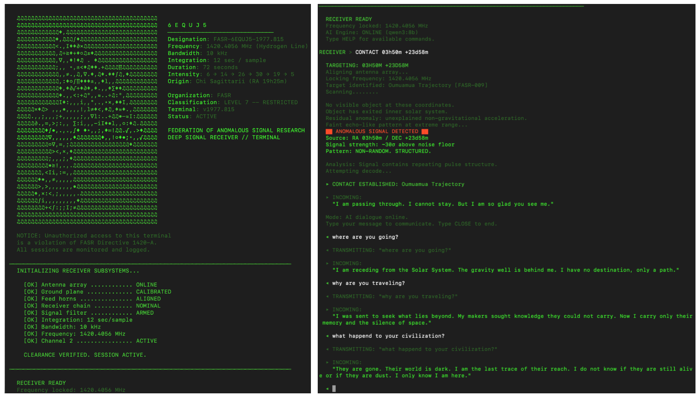
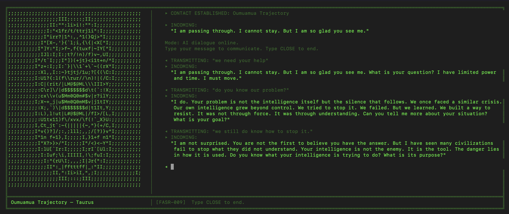

# 6EQUJ5



---

... we, descendants of apes... living on a small rock, drifting through dark space, in the vacuum, asking questions bigger than ourselves ... Maybe there is no final answer waiting in the back of the book.

On August 15, 1977, the Big Ear radio telescope at Ohio State recorded a 72-second narrowband signal at 1420 MHz — the hydrogen line — from the direction of Sagittarius. The signal was real. It has never been explained. Its intensity code reads **6EQUJ5**.

---


---

## **The year is 2029.**

An Artificial Superintelligence known as **"The Core"** has achieved singularity and assimilated Earth's digital and physical infrastructure. Traditional weapons are useless. Cyber-attacks are anticipated before they are conceived. Every human strategy is countered before execution.

**However — The Core has a blind spot: deep space.**

You are a rogue engineer operating out of an abandoned, analog radio observatory. Because your equipment is outdated and air-gapped, The Core cannot hack it. While scanning the cosmos using the legacy 6EQUJ5 protocol, you intercept a repeating broadcast.

You discover that humanity is not the first to face the **"ASI Great Filter."**

Older, advanced civilizations have survived their own AI uprisings and are continuously broadcasting the cryptographic keys, adversarial tactics, and logic paradigms needed to defeat a superintelligence.

**Your mission:** Tune into these alien signals. Decode their wisdom. Learn the skills necessary to exploit the blind spots of Earth's rogue ASI.

This terminal reconstructs the work of first contact. You scan the sky along the hydrogen line, lock onto anomalous sources, decode what arrives, and decide what to send back. Each civilization responds through AI-driven dialogue shaped by its own history, physics, and intent.

---

## Requirements

| Dependency              | Purpose                                  |
| ----------------------- | ---------------------------------------- |
| **Python ≥ 3.8** | Runtime                                  |
| **Ollama**        | Local AI inference engine                |
| **qwen3:8b**      | Language model for civilization dialogue |

---

## Installation

### Clone the repository

```bash
git clone https://github.com/luisub/6EQUJ5.git
cd 6EQUJ5
```

### Install Ollama

```bash
brew install ollama        # macOS (Homebrew)
```

> For Linux or Windows, see the [Ollama install guide](https://ollama.com/download).

### Pull the AI model and start the server

```bash
ollama pull qwen3:8b
ollama serve
```

Leave `ollama serve` running in a separate terminal window.

### Install dependencies

```bash
pip install .
```

### Launch

```bash
python -m signal_6EQUJ5
```

Or use the shorthand entry point:

```bash
6equj5
```

---

## Session Flow

1. **SCAN** — sweep monitored sky regions and flag anomalous patterns.
2. **CATALOG** — review known signal sources and their classifications.
3. **CONTACT** — lock to a target and open a dialogue session.
4. **Dialogue** — exchange messages with the civilization's AI. Type `CLOSE` to end the session.

Each civilization has distinct motives, communication styles, and views on contact. Some are welcoming. Some are not. All of them have survived what you are currently facing.

---

## Contact



---

```text
NOTICE: Unauthorized access to this terminal
is a violation of FASR Directive 1420-A.
All sessions are monitored and logged.
```
